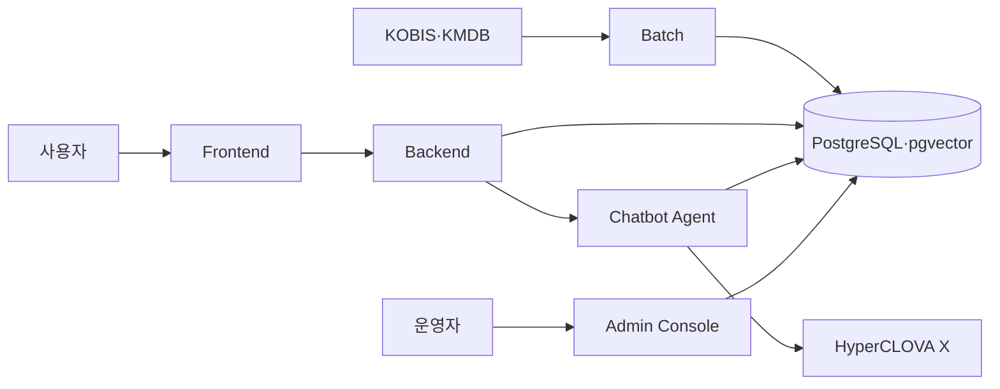

# Pop Talk

Pop Talk은 영화 메타데이터와 사용자 리뷰를 결합해 상황과 취향에 맞는 영화를 추천하고, 추천 이유와 근거를 함께 제공하는 영화 탐색 서비스입니다. NIPA–NAVER Cloud Sovereign AI PBL 과정에서 4인 팀으로 개발했으며 우수상을 수상했습니다.

이 저장소는 팀 조직의 여러 저장소에 나뉘어 있던 최종 서비스를 한곳에서 살펴볼 수 있도록 정리한 통합본입니다. 원본 저장소와 기여 이력은 [`ncp-team-hope`](https://github.com/ncp-team-hope) 조직에서 관리합니다.

## 구성

| 디렉터리 | 원본 저장소 | 역할 |
|---|---|---|
| [`frontend`](frontend/) | `ncp-team-hope/pop_talk_fe` | 사용자가 보는 영화 탐색·상세·리뷰·AI 추천 화면 |
| [`backend`](backend/) | `ncp-team-hope/pop_talk_was` | 인증, 영화, 리뷰와 사용자 기능을 제공하는 FastAPI 서비스 |
| [`chatbot`](chatbot/) | `ncp-team-hope/pop_talk_chatbot` | HyperCLOVA X, LangGraph와 RAG 기반 영화 질의·추천 Agent |
| [`batch`](batch/) | `ncp-team-hope/pop_talk_batch` | KOBIS·KMDB 수집, 정제, 적재와 임베딩 작업 |
| [`admin`](admin/) | `ncp-team-hope/pop_talk/apps/admin` | 영화 데이터, 인증 상태와 배치 결과를 관리하는 Admin Console |

통합 시점의 원본 `main` 커밋은 다음과 같습니다.

| 영역 | 커밋 |
|---|---|
| Admin Console | `290f7aaba9c3c794e9f509a2a6d3ad78e92ac0c4` |
| Frontend | `5b281f73577ca104af17a014c38430203fe0b45f` |
| Backend | `1f03d510960bcbfd5144bff8553128d1d5e7e7c6` |
| Chatbot | `d6cc8c92580cd7514df4abea306d7d55034e18e6` |
| Batch | `8a4ab85a06a4638109a39d696f8ca831ac0a49de` |

## 데이터와 Agent 흐름

배치는 영화 목록·상세·포스터·등급·줄거리·키워드를 수집하고 정제한 뒤 PostgreSQL에 적재합니다. 영화와 리뷰 임베딩은 pgvector에 저장되며, Agent는 질문 의도를 분류해 SQL 조회와 벡터 검색을 선택합니다. 생성한 답변은 근거 ID, 의도 일치, 사실성, 완전성과 스포일러 안전성을 검수하고 실패 원인에 따라 필요한 단계부터 다시 실행합니다.

## 주요 결과

- 영화 메타데이터 5,315편 구축
- 인증 완료 영화 5,309편
- 누적 감상평 59,863건
- 영화 탐색, 상세, 리뷰와 취향 온보딩 연결
- 자연어 추천 이유와 외부 리뷰 근거 제공
- 수집 영화 검수와 배치 처리 현황을 확인하는 Admin Console 구축

## 담당 영역

- KOBIS·KMDB 데이터 수집, 정제, 병합과 PostgreSQL 적재
- 영화·리뷰 임베딩 및 pgvector 검색 흐름
- 의도 분류, QueryPlan, 검색, 생성과 검수로 구성한 Agent 흐름
- 근거가 부족하거나 검수에 실패한 응답의 재시도와 안전한 폴백

각 서비스의 실행 방법과 환경 변수는 해당 디렉터리의 README와 `.env.example`을 참고하세요. 실제 인증정보, 배포 키, 운영 데이터와 팀원 개인정보는 이 저장소에 포함하지 않습니다.

프로젝트 화면과 자세한 설명은 [포트폴리오의 Pop Talk 페이지](https://junhyeok94-la.github.io/projects/pop-talk/)에서 볼 수 있습니다.

## 통합 기준

이전 개인 통합 저장소 `junhyeok94-la/popcorn-repo`의 파일도 별도로 비교했습니다. 최종 팀 저장소에서 발전된 Backend·Chatbot·Batch 구현을 우선했고, 이전 기획 문서 중 현재 구조를 이해하는 데 도움이 되는 자료는 [`docs/historical-planning`](docs/historical-planning/)에 구분해 보존했습니다. 초기 수집 데이터, 폐기된 구현, Terraform 상태 관련 자료, 환경파일과 개인키는 통합본에서 제외했습니다.

## 팀 프로젝트

이 프로젝트는 4인 팀으로 개발했습니다. 이 저장소는 개인 포트폴리오를 위한 통합 열람본이며, 전체 결과를 개인 단독 작업으로 표현하지 않습니다.
