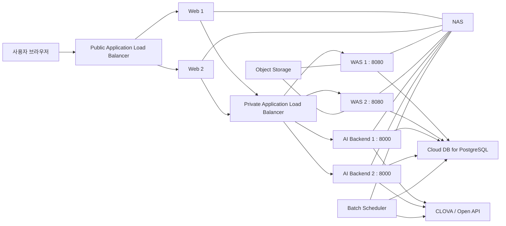
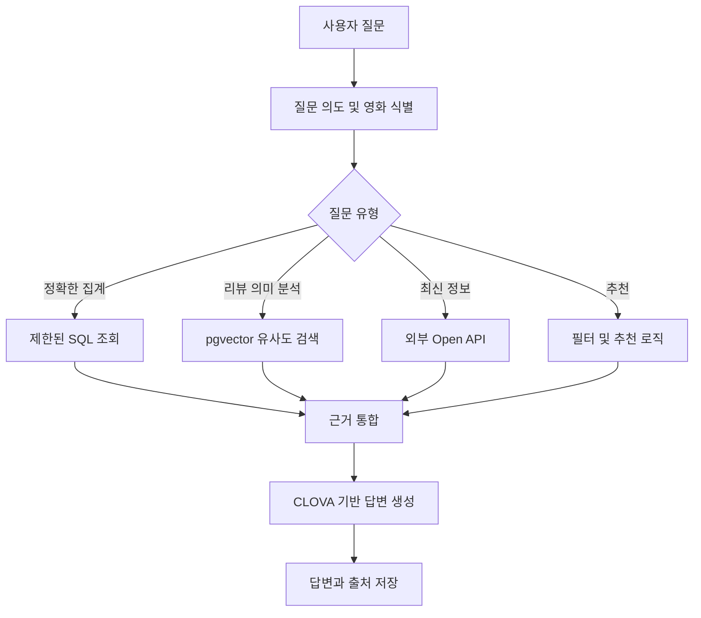

# 애플리케이션 및 시스템 설계

## 1. 설계 방향

시연 환경에서도 계층별 책임과 트래픽 흐름을 확인할 수 있도록 Web, WAS와 AI Backend를 분리하고 주요 서버를 이중화합니다. Batch Scheduler는 사용자 요청 경로에서 분리합니다.

현재 서버 구분은 배포 단위를 의미합니다. 구체적인 프레임워크는 팀 합의 후 확정합니다.

## 2. 논리 구성



논리도는 역할을 설명하기 위한 것입니다. 실제 Web→WAS와 WAS→Backend 호출 경로, Private LB의 리스너 사용 방식은 API 설계와 함께 확정해야 합니다.

## 3. 컴포넌트 책임

| 컴포넌트 | 수량 | 기본 포트 | 책임 |
|---|---:|---:|---|
| Web | 2 | 80 | 프런트엔드 정적 파일, 리버스 프록시 또는 프런트엔드 서버 |
| WAS | 2 | 8080 | 인증, 회원, 영화, 리뷰, 챌린지 등 핵심 비즈니스 API |
| AI Backend | 2 | 8000 | LangGraph, SQL·Vector 검색, CLOVA 연동과 AI 응답 |
| Batch Scheduler | 1 | 해당 없음 | 데이터 동기화, 임베딩과 예약 작업 |
| PostgreSQL | 1 | 5432 | 서비스 원본 데이터와 pgvector 저장 |

Web/WAS/Backend 서버는 모두 동일한 Private App Subnet에 있지만, ACG를 역할별로 나눠 접근 경로를 제한합니다.

## 4. AI 질의 처리



리뷰 원문은 PostgreSQL이 관리하고 Vector 데이터는 의미 검색용 임베딩과 원문 식별자를 저장합니다. 리뷰가 수정·삭제·차단되면 임베딩도 다시 생성하거나 검색 대상에서 제외해야 합니다.

## 5. 데이터 영역

주요 데이터 그룹은 다음과 같습니다.

- 사용자, 권한과 인증정보
- 영화 기본정보와 외부 데이터 식별자
- 평점, 리뷰, 댓글과 좋아요
- 챌린지 정의 및 사용자 참여 이력
- 리뷰·영화 임베딩과 임베딩 작업 큐
- AI 대화 세션, 메시지와 답변 근거
- 배치 실행 및 실패 이력

DB 스키마는 마이그레이션 도구로 버전 관리하고 서버에서 직접 수동 변경하지 않습니다.

## 6. 저장소와 디렉터리 방향

팀 합의 전의 권장 상위 구조입니다.

```text
popcorn-repo/
├── front-end/
├── was/
├── back-end/
├── batch/
├── database/
├── docs/
├── scripts/
└── README.md
```

기술 스택이 결정되면 각 디렉터리의 빌드, 테스트와 실행 방법을 해당 디렉터리의 README에 작성합니다.

## 7. 품질 기준

- 모든 서비스는 상태 확인용 `/health` 또는 동등한 엔드포인트를 제공합니다.
- 외부 API 호출에는 timeout, 재시도와 호출량 제한을 적용합니다.
- 로그에 비밀번호, 토큰과 개인정보를 남기지 않습니다.
- DB 변경은 migration으로 재현 가능해야 합니다.
- AI 답변은 검색 근거가 없을 때 추측하지 않고 자료 부족을 알립니다.
- 배치 작업은 중복 실행되어도 데이터가 훼손되지 않도록 멱등성을 확보합니다.

